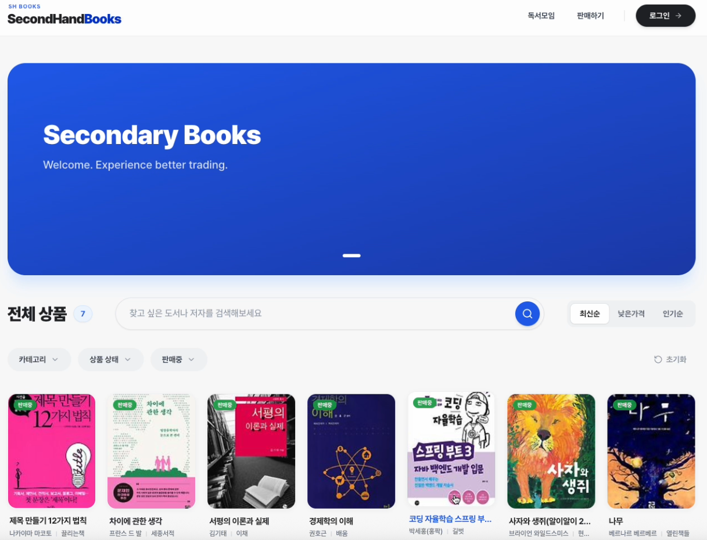
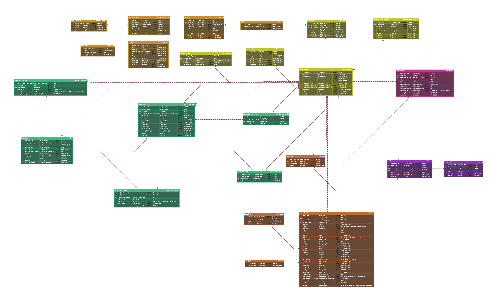
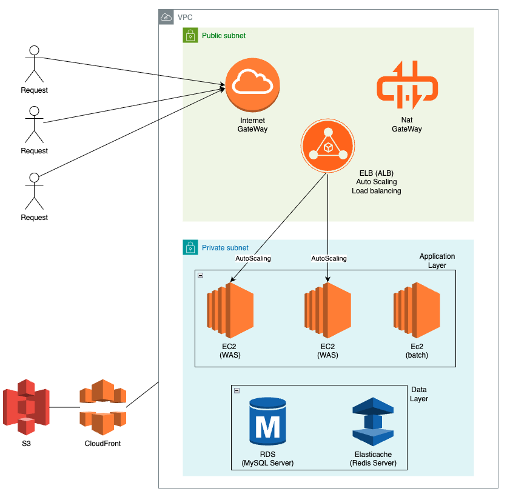
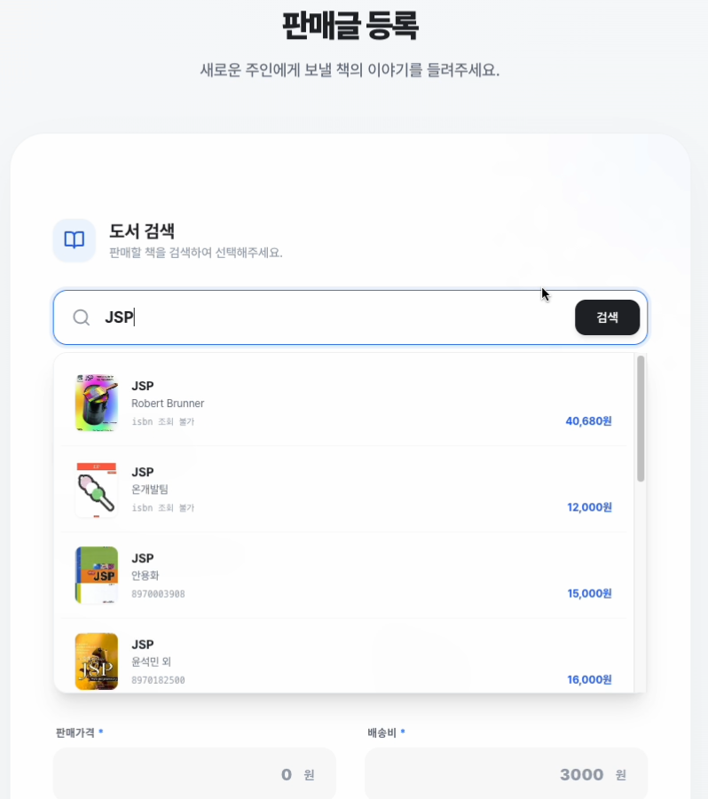
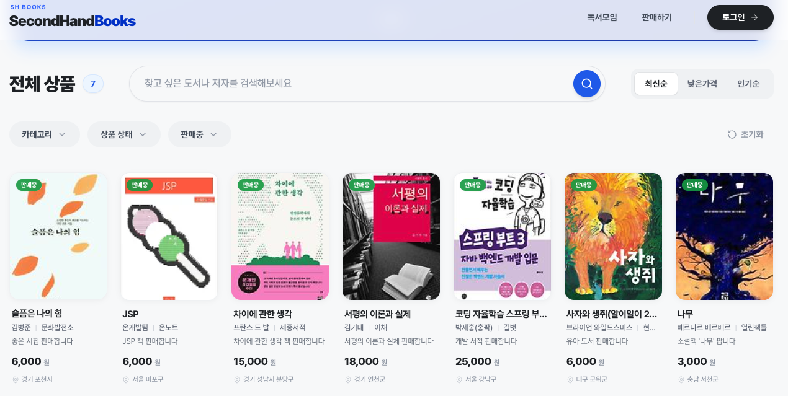
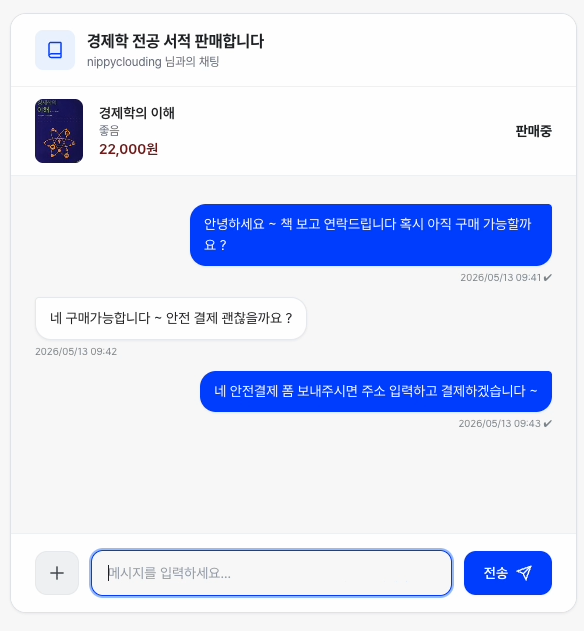
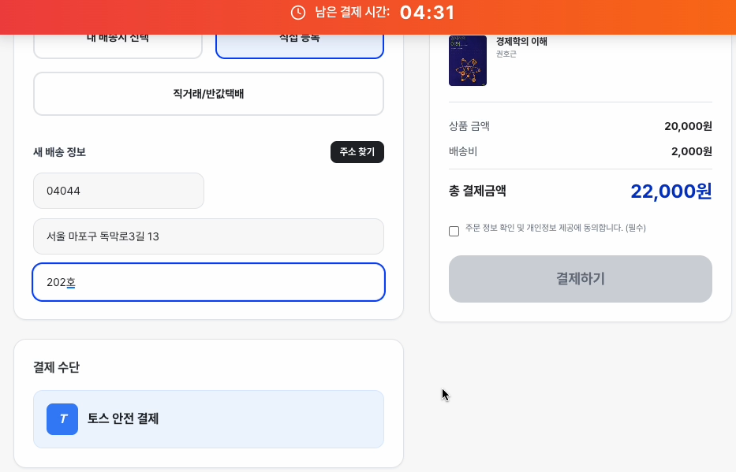
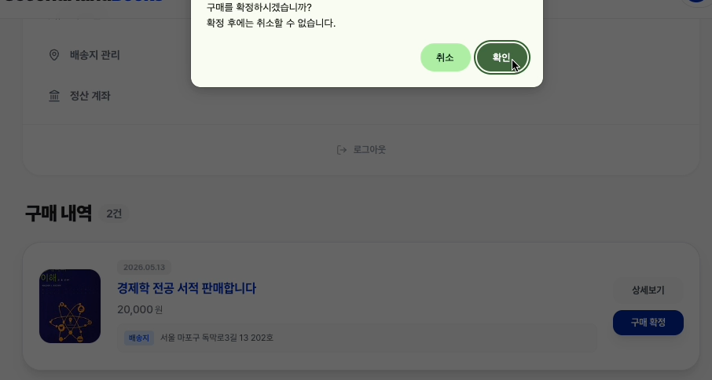
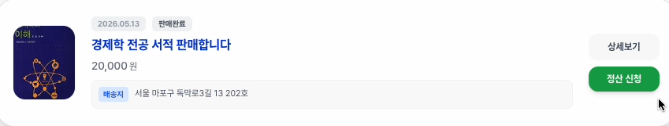
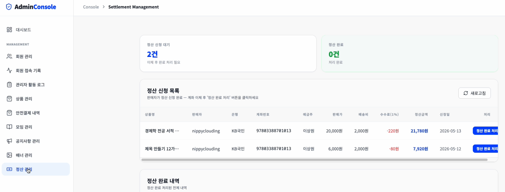

# SecondHandBooks

**중고책 ESCROW 기반 안전 거래 플랫폼**

해당 파일은 기능 서술에 초점을 두고 있습니다. 기술적 의사 고민 등과 같은 부분은 <a href="https://nippyclouding.github.io/project.html">포트폴리오</a>에서 확인할 수 있습니다.

중고 시장에서는 판매자의 악의적인 사기로 인한 피해가 빈번하게 발생합니다. 
SecondHandBooks는 중고책 거래에 안전 결제 개념을 도입하여 이러한 문제를 해결합니다.

**ESCROW**는 판매자와 구매자 사이에서 신뢰할 수 있는 중립적인 제삼자가 금전 또는 물품 거래를 중개하는 서비스입니다. 
우리 플랫폼은 구매자의 거래 금액이 판매자에게 바로 전달되지 않고 Toss Payments 결제를 거쳐 플랫폼에 보관되도록 합니다. 이후 구매자가 물건을 수령하고 구매확정을 진행하면 판매자에게 정산되는 ESCROW 시스템을 제공합니다.

**주요 기능**

사용자는 중고책 판매글을 등록할 수 있으며, 
구매자는 판매자와 1:1 채팅 후 Toss Payments 기반 안전결제를 진행할 수 있습니다. 
거래 완료 후 구매확정 및 판매자 정산 요청 기능을 제공하며, 독서모임 커뮤니티 기능도 함께 운영됩니다.

---

---

### 개발 과정 & 사용 기술

**개발 기간**
- 2개월 (2026.01.~2026.02.)

**개발 인원**
- 6명 (프론트엔드 2명, 백엔드 4명)

**개발 환경**
- **Language & DB**: Java 17, MySQL 8, Redis 8
- **Framework**: Spring Framework with MyBatis
- **Auth**: Session & Cookie
- **Real-Time**: STOMP WebSocket
- **Frontend**: Javascript, JSP (Server Side Rendering)
- **Infrastructure**: AWS EC2 & ELB with Auto Scaling & RDS, ElastiCache Redis, S3, CloudFront & CloudWatch

---

### 1. ERD

  <a href="https://www.erdcloud.com/d/hHEF9MxFtqDsgh9ks">ERDCloud에서 자세히 보기</a>

---

### 2. SYSTEM ARCHITECTURE

---

### 3. 주요 기능

#### **중고책 판매글 등록**
판매자는 중고책 판매글을 등록할 수 있으며, 
다중 이미지 업로드 및 카카오 도서 API 기반 도서 정보 조회를 통해 정확한 값을 등록할 수 있습니다.

#### **중고책 거래 목록 조회**
사용자는 판매 상태, 카테고리, 검색어, 정렬 조건 기반으로 거래 목록을 조회할 수 있습니다. 
거래 목록은 페이징 처리되며 Redis Cache를 적용해 반복 조회 성능을 개선했습니다.

#### **1:1 실시간 채팅**
구매자는 판매자와 실시간 1:1 채팅을 진행할 수 있습니다. 
STOMP 기반 WebSocket 채팅을 구현했으며, Redis Pub/Sub을 적용해 멀티 서버 환경에서도 메시지를 동기화했습니다.

#### **안전결제**
구매자는 Toss Payments 기반 안전결제를 진행할 수 있습니다. 
안전결제 상태를 NONE → PENDING → COMPLETED 흐름으로 관리했으며, 조건부 UPDATE를 적용해 중복 결제 및 비인가 결제 요청을 방지했습니다.

#### **구매확정**

안전 결제 이후 구매자는 배송 수령을 한 뒤 구매확정을 진행할 수 있습니다. 
안전 결제 이후 15일 내에 구매확정이 없을 경우 스케줄러를 통해 자동으로 구매확정 처리합니다.code  

#### **판매자 정산 요청**
판매자는 구매확정된 거래에 대해 정산 요청을 할 수 있습니다. 
정산 상태는  NONE -> READY -> REQUESTED -> COMPLETED 입니다.

#### **관리자 정산 관리**
관리자는 안전 결제 내역 조회 및 정산 신청 관리 기능을 가집니다.  

---

### 4. 시연

SecondHandBooks의 주요 화면 흐름과 기능 동작을 영상으로 확인할 수 있습니다.

