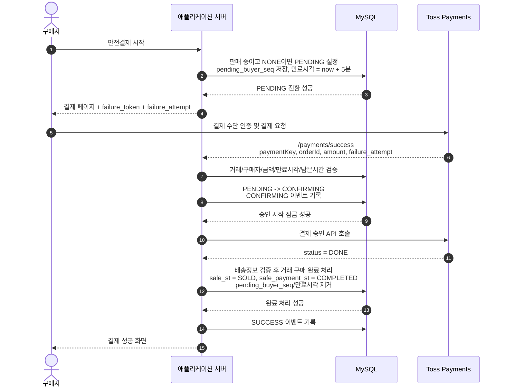
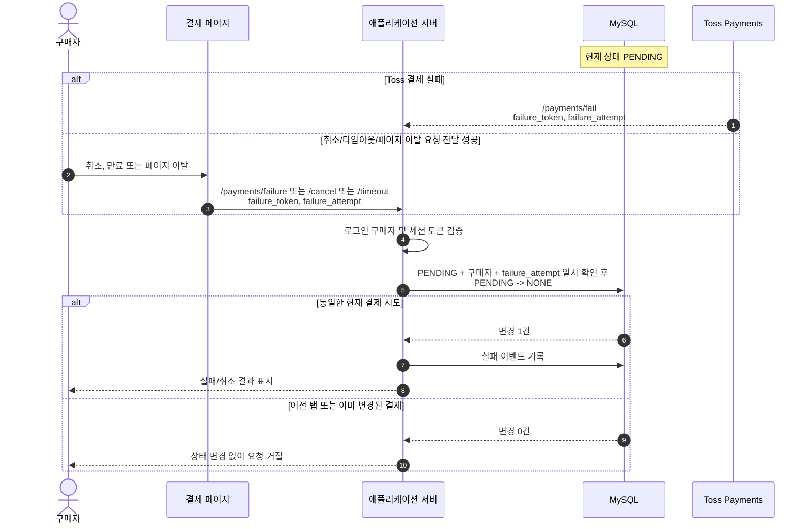
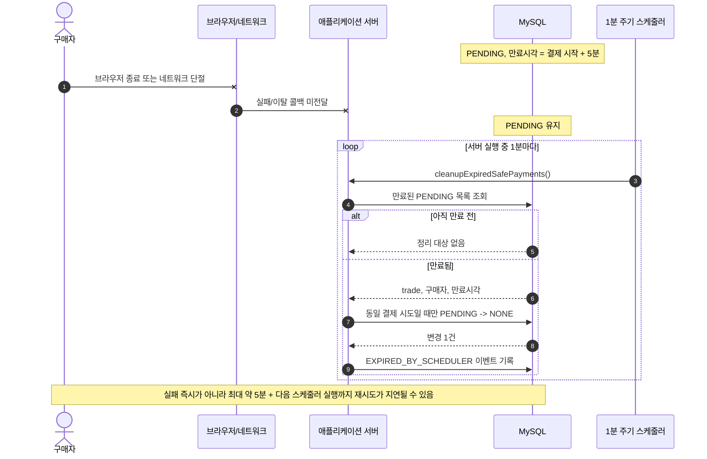
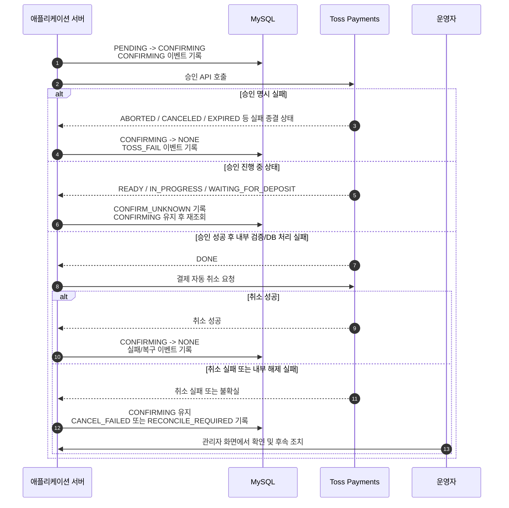
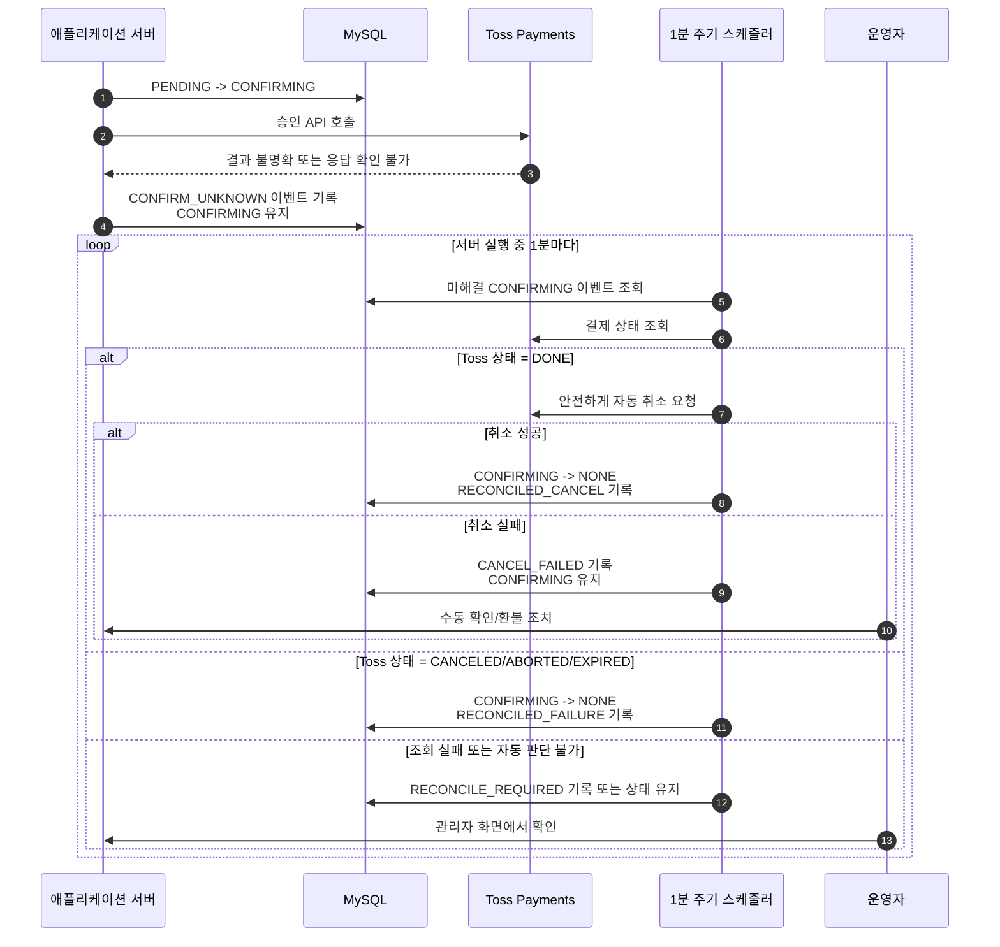

# 안전결제 운영 흐름 및 실패 처리

## 목적

이 문서는 현재 안전결제 구현의 상태 전이, 결제 성공 처리, 실패 및 복구 처리, 운영에서 남는 제한을 설명한다.

## 상태값

| 상태 | 의미 | 다음 상태 |
| --- | --- | --- |
| `NONE` | 진행 중인 안전결제 없음 | 구매자의 안전결제 시작 시 `PENDING` |
| `PENDING` | 구매자가 결제창에서 결제 진행 중. 시작 시점부터 5분 만료시간과 구매자 식별값 저장 | 승인 시작 시 `CONFIRMING`, 실패/취소/만료 시 `NONE` |
| `CONFIRMING` | Toss 승인 요청이 시작되었거나 승인 결과 확인·보상 취소가 필요한 상태 | 구매 완료 시 `COMPLETED`, 승인 실패 또는 승인 후 취소 완료 시 `NONE` |
| `COMPLETED` | 결제 승인 및 내부 구매 완료 처리 완료 | 후속 구매확정/정산 절차 |

### 상태 전이 원칙

- `NONE -> PENDING`은 상품이 판매 중이고 다른 안전결제가 진행 중이지 않을 때만 허용한다.
- `PENDING -> CONFIRMING`은 현재 구매자와 해당 결제 시도의 만료시각(`failure_attempt`)이 일치하며 만료되지 않았을 때만 허용한다.
- `PENDING -> NONE`은 실패 요청 또는 만료 스케줄러가 **동일 구매자와 동일 결제 시도 만료시각**까지 확인한 경우에만 수행한다.
- `CONFIRMING -> COMPLETED`는 Toss 승인 결과가 `DONE`이고 배송/거래 완료 DB 처리가 성공한 경우에만 수행한다.
- `CONFIRMING` 상태에서 결과가 불명확하면 즉시 `COMPLETED`로 변경하지 않는다. 조회·취소 복구 또는 운영 확인 대상으로 유지한다.

## 결제 성공 흐름

안전결제 시작 시 거래는 `PENDING`으로 전환되고 5분 만료시각이 저장된다. Toss 성공 리다이렉트가 도착하면 서버는 현재 결제 시도인지 다시 검증한 후, 승인 처리 전 `CONFIRMING`으로 먼저 잠근다. Toss 승인과 내부 구매 완료가 모두 성공해야 `COMPLETED`가 된다.

## 결제 실패 경우의 수

| 구분 | 발생 예시 | 최종 처리 |
| --- | --- | --- |
| Toss 실패 리다이렉트 | 카드 거절, 인증 실패, Toss 결제 실패 | 토큰·결제시도 검증 후 `PENDING -> NONE`, `TOSS_FAIL` 기록 |
| 사용자의 결제 중단 | 취소 버튼, 페이지 이탈 요청 전달 성공 | 검증 후 `PENDING -> NONE`, `USER_CANCEL` 또는 `PAGE_LEAVE` 기록 |
| 결제 시간 만료 | 브라우저 타이머 만료 요청 또는 서버 만료 정리 | 검증 후 `PENDING -> NONE`, `TIMEOUT` 또는 `EXPIRED_BY_SCHEDULER` 기록 |
| 성공 콜백 검증 실패 | 금액 불일치, 이미 만료된 결제, 다른 시도의 콜백 | 해당 시도가 아직 `PENDING`이면 그 시도만 `NONE`으로 해제, 아니면 상태 변경 없음 |
| Toss 승인 명시 실패 | 승인 API 결과가 실패 상태 | `CONFIRMING -> NONE`, `TOSS_FAIL` 기록 |
| Toss 승인 진행 중 상태 | 승인 응답이 `READY`, `IN_PROGRESS`, `WAITING_FOR_DEPOSIT` | 확정 실패로 해제하지 않고 `CONFIRMING` 유지 후 재조회 |
| 승인 성공 후 내부 처리 실패 | 배송정보 오류, 구매 완료 DB 오류 | Toss 자동 취소 시도 후 성공하면 `CONFIRMING -> NONE`; 취소 실패 시 운영 확인 유지 |
| 승인 결과 불명확 | 승인 API 타임아웃, 결과 코드 불명확, 재조회 장애 | `CONFIRMING` 유지 후 스케줄러 재조회·취소 또는 운영 확인 |
| 실패 콜백 미도달 | 네트워크 단절, 브라우저 종료, 세션 손실 | `PENDING` 만료 후 스케줄러가 `NONE`으로 정리 |

## 실패 흐름: 즉시 실패 또는 사용자 취소

Toss 실패 리다이렉트와 결제 페이지의 취소·타임아웃·페이지 이탈 요청은 모두 현재 시도의 토큰과 만료시각을 확인한다. 이전 탭이나 이전 결제의 늦은 요청은 새 결제를 해제할 수 없다.

## 실패 흐름: 콜백이 서버에 도달하지 않은 경우

결제 실패 사실이 브라우저 또는 네트워크 문제로 서버에 전달되지 않으면 서버는 즉시 알 수 없다. 이 경우 서버에서 계속 실행되는 스케줄러가 만료된 `PENDING` 건을 정리한다.

## 실패 흐름: 승인 실패 또는 승인 후 내부 처리 실패

승인 호출 전에 거래는 `CONFIRMING`으로 바뀐다. 따라서 승인 요청이 시작된 거래를 단순 만료 정리로 풀지 않는다. Toss가 명시적으로 승인 실패를 반환하거나, 승인 이후 내부 완료 처리가 실패해 Toss 취소까지 성공한 경우에만 `NONE`으로 되돌린다.

## 실패 흐름: 승인 결과가 불명확한 경우

승인 응답을 확정할 수 없는 경우 잘못된 판매 완료나 중복 처리 위험을 피하기 위해 거래를 `CONFIRMING`으로 유지한다. 스케줄러는 1분마다 복구 대상을 조회하며, Toss 상태가 확인된 뒤에만 취소 또는 내부 상태 해제를 수행한다.

## 운영에서 남는 제한

### 1. 실패 요청 자체가 도달하지 않으면 즉시 해제할 수 없음

결제 실패 직후 네트워크가 끊기거나 사용자가 브라우저를 닫아 실패 리다이렉트와 페이지 이탈 요청이 모두 서버에 전달되지 않을 수 있다. 서버는 해당 실패 사실을 즉시 알 수 없으므로 거래는 만료 시점까지 `PENDING`으로 남는다.

- 결제 시작 시 저장한 만료시간은 5분이다.
- 스케줄러는 서버 실행 중 1분마다 만료된 `PENDING`을 정리한다.
- 따라서 사용자는 결제 시작 후 최대 약 5분과 다음 스케줄러 실행까지 재결제가 지연될 수 있다.
- 정리 조건에 결제 시도 만료시각까지 포함하므로, 만료된 이전 시도의 정리가 이후 새 결제를 해제하지는 않는다.

### 2. 세션 손실 시 즉시 실패 검증이 불가능함

실패 콜백 처리에는 로그인 구매자 세션과 결제 페이지에서 발급한 세션 토큰 검증이 필요하다. 결제 중 로그아웃, 세션 삭제, 별도 브라우저로의 전환 등으로 세션이 유실되면 실패 콜백에서 즉시 상태를 해제할 수 없고 만료 스케줄러에 의해 정리된다.

### 3. 외부 결제사 조회 또는 취소 장애는 자동 확정할 수 없음

승인 요청 후 Toss 결과가 불명확하거나, 승인된 결제의 자동 취소 요청이 실패하면 시스템은 거래를 임의로 `COMPLETED` 또는 `NONE`으로 변경하지 않는다. `CONFIRMING` 상태와 결제 이벤트 로그를 유지하고 관리자 화면에서 확인할 수 있도록 한다.

- 승인됐을 수 있는 결제를 무단 해제하면 상품 재판매 또는 환불 누락 위험이 있다.
- 승인되지 않은 결제를 완료 처리하면 구매자 청구와 내부 거래 상태가 불일치할 수 있다.
- 따라서 불명확 건은 자동 재조회·취소를 시도하되, 최종 판단이 되지 않으면 운영자 확인이 필요하다.

## 배포 유의사항

이번 처리 흐름은 결제 페이지가 전달하는 `failure_attempt` 및 `failure_token`을 사용한다. 변경 배포 전에 이미 열린 구버전 결제 페이지가 존재하면 새 서버의 콜백 검증을 통과하지 못할 수 있다.

- 배포 직전 신규 안전결제 진입을 일시 차단한다.
- 기존 `PENDING` 결제의 5분 처리 구간과 다음 스케줄러 정리 시간을 확보한다.
- 현재 프로젝트 설정에는 Flyway/Liquibase 자동 실행 구성이 없으므로, `mvc/src/main/resources/db/migration/V20260523__payment_confirmation_event_log.sql`을 운영 DB에 배포 절차로 직접 적용한다.
- DB 변경 적용 완료를 확인한 이후 애플리케이션을 배포한다.

## 개인정보 및 거래기록 보존 정책

안전결제 거래의 감사 및 소비자 대응을 위해 법정 보존 대상 기록은 회원 탈퇴 또는 거래 화면 비노출 이후에도 보존한다. 운영자는 보존 대상 데이터에 대한 접근 권한을 최소화하고, 보존기간 종료 후 다른 법적 보존 사유가 없는 기록을 파기한다.

| 기록 | 보존기간 | 현재 저장 위치 |
| --- | ---: | --- |
| 계약 또는 청약철회 등에 관한 기록 | 5년 | `sb_trade_info`, 후속 취소/분쟁 기록 저장소 |
| 대금결제 및 재화 등의 공급에 관한 기록 | 5년 | `sb_trade_info`, `payment_event_log`, `settlement` |
| 소비자의 불만 또는 분쟁처리에 관한 기록 | 3년 | 고객지원/분쟁 처리 저장소 |

- `sb_trade_info`는 거래 삭제 요청 시 `del_dtm`을 설정하는 논리 삭제 방식을 유지하여 거래 원장을 즉시 물리 삭제하지 않는다.
- `payment_event_log`는 승인, 실패, 취소 복구와 대사에 필요한 감사 이력으로 거래 또는 회원의 논리 삭제와 별개로 유지한다.
- `settlement`는 지급 내역 증빙으로 거래 원장과 함께 5년 보존 대상으로 취급한다.
- 현재 별도 고객지원/분쟁 접수 테이블은 구현되어 있지 않으므로, 해당 기능 도입 시 생성일 기준 3년 보존과 접근통제를 함께 구현해야 한다.
